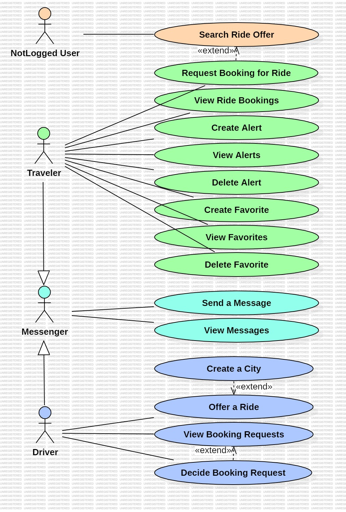

# Use Case Model

(Search Ride Offer) A not logged-in users can search for available ride offers.

(Request Booking for Ride) A traveler can request a booking for a specific ride offer.
(View Ride Bookings) A traveler can access their current ride bookings.
(Create Alert) A traveler can set up an alert for a specific ride.
(View Alerts)  A traveler can view their alerts for specific rides.
(Delete Alert) A traveler can delete their alerts created beforehand.
(Create Favorite) A traveler can add a favorite for a specific ride.
(View Favorites)  A traveler can view their favorites for specific rides.
(Delete Favorite) A traveler can delete their favorites created beforehand.

(Send a Message) A messenger can send a message to other messengers.
(View Messages) A messenger can open his chat overview and chat history.

(Create a City) A driver can add new cities to the system when creating a ride offer
(Offer a Ride) A driver can create ride offers for travelers.
(View Booking Requests) A driver can view incoming booking requests for an offered ride.
(Decide Booking Request) A driver can accept or decline incoming booking requests for an offered ride.